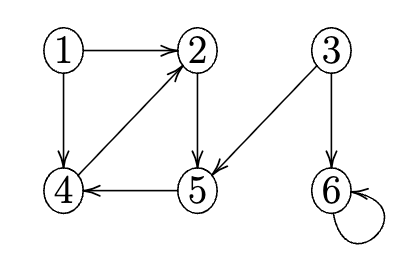

# Exercise Sheet 13

Handout: December 2nd — Deadline: December 9th, 4pm

 

## **Question 13.1** (0.5 marks)

Consider a directed graph $G(V, E)$.

1.  With an adjacency list representation, how long does it take to compute the in-degree of a vertex $v \in V$?
2.  With an adjacency list representation, how long does it take to compute the in-degrees of all vertices $v \in V$?
3.  With an adjacency matrix representation, how long does it take to compute the in-degree of a vertex $v \in V$?
4.  With an adjacency matrix representation, how long does it take to compute the in-degree of all vertices $v \in V$?

### Answer:

1. With an adjacency list representation, computing the in-degree of a vertex \( v \in V \) takes \( O(E) \) time. This is because we need to traverse all edges to count how many times vertex \( v \) appears as a destination.
2. With an adjacency list representation, computing the in-degrees of all vertices \( v \in V \) takes \( O(V + E) \) time. This is because we need to traverse all adjacency lists to count the in-degrees.
3. With an adjacency matrix representation, computing the in-degree of a vertex \( v \in V \) takes \( O(V) \) time. This is because we need to check each entry in the column corresponding to vertex \( v \).
4. With an adjacency matrix representation, computing the in-degrees of all vertices \( v \in V \) takes \( O(V^2) \) time. This is because we need to check each entry in the matrix.

 

## **Question 13.2** (0.5 marks)

A mayor of a city decides to monitor every road in the city with $360^\circ$ video surveillance cameras. Imagine the road network as an undirected graph where edges represent roads and vertices represent junctions. When a video camera is placed on a junction, it can monitor all incident roads.

In graph terms, an edge is called *monitored* if there is a camera on at least one of its vertices. The goal is to identify on which vertices to put cameras in order to monitor every edge with a minimum number of cameras.

The mayor decides to use the following strategy: *While there is an unmonitored edge, put video cameras on **both** of its vertices.*

How good is this strategy? Does it always produce an optimal solution? Does it come close? Justify your answer.

Can you think of a greedy strategy for this problem?

### Answer:

The mayor's strategy is not optimal. This approach can lead to placing cameras on vertices that are already monitored by other edges, resulting in unnecessary camera placements.

For example, consider a rectangle graph with vertices \( A, B, C, D \) and edges \( (A, B), (B, C), (C, D), (D, A) \). If the mayor places cameras on both vertices of edge \( (A, B) \), he will place cameras on vertices \( A \) and \( B \), which will also monitor edges \( (B, C) \) and \( (D, A) \), leaving edge \( (C, D) \) unmonitored. To monitor edge \( (C, D) \), he would need to place additional cameras on vertices \( C \) and \( D \), resulting in a total of four cameras. However, a more optimal solution would be to place a camera on just two vertices, say \( A \) and \( C \), which would monitor all four edges with only two cameras.

Although not optimal, this strategy is known as a 2-approximation algorithm, meaning the solution size is guaranteed to be at most twice the size of the optimal solution.

Here's the proof of the 2-approximation:
Let \( M \) be the set of edges selected by the mayor's strategy. Each edge in \( M \) requires two cameras, one on each vertex. Since no two edges in \( M \) share a vertex (otherwise, the edge would already be monitored), the optimal solution must place at least one camera for each edge in \( M \). Therefore, if the optimal solution uses \( k \) cameras, the mayor's strategy uses at most \( 2k \) cameras, proving it is a 2-approximation.

A greedy strategy for this problem could be to always place a camera on the vertex with the highest degree among the vertices of an unmonitored edge. This way, each camera placement maximizes the number of edges monitored.
 

## **Question 13.3** (0.25 marks)

Perform a breadth-first search on the following graph with vertex 3 as source. Show the $d$ and $\pi$ values of each node.

### Answer:

Starting BFS from vertex 3, we initialize the distances \( d \) and predecessors \( \pi \) for each vertex as follows:
- Vertex 1: \( d = \infty, \pi = \text{NULL}, color = \text{white} \)
- Vertex 2: \( d = \infty, \pi = \text{NULL}, color = \text{white} \)
- Vertex 3: \( d = 0, \pi = \text{NULL}, color = \text{gray} \)
- Vertex 4: \( d = \infty, \pi = \text{NULL}, color = \text{white} \)
- Vertex 5: \( d = \infty, \pi = \text{NULL}, color = \text{white} \)
- Vertex 6: \( d = \infty, \pi = \text{NULL}, color = \text{white} \)

We then explore the graph level by level:
1. Start with vertex 3:
   - Neighbors: 5, 6
    - Update: 
      - Vertex 5: \( d = 1, \pi = 3, color = \text{gray} \)
      - Vertex 6: \( d = 1, \pi = 3, color = \text{gray} \)
    - Mark vertex 3 as fully explored: $color$= black 
2. Next, explore vertex 5:
    - Neighbors: 4
     - Update:
        - Vertex 4: \( d = 2, \pi = 5, color = \text{gray} \)
    - Mark vertex 5 as fully explored: $color$= black
3. Next, explore vertex 6:
    - Neighbors: 6
     - vertex 6 is not white, so no update
    - Mark vertex 6 as fully explored: $color$= black
4. Next, explore vertex 4:
    - Neighbors: 2
     - Update:
        - Vertex 2: \( d = 3, \pi = 4, color = \text{gray} \)
    - Mark vertex 4 as fully explored: $color$= black
5. Next, explore vertex 2:
    - Neighbors: 5
        - vertex 5 is not white, so no update
    - Mark vertex 2 as fully explored: $color$= black

After completing the BFS, the final \( d \) and \( \pi \) values for each vertex are:
- Vertex 1: \( d = \infty, \pi = \text{NULL} \)
- Vertex 2: \( d = 3, \pi = 4 \)
- Vertex 3: \( d = 0, \pi = \text{NULL} \)
- Vertex 4: \( d = 2, \pi = 5 \)
- Vertex 5: \( d = 1, \pi = 3 \)
- Vertex 6: \( d = 1, \pi = 3 \)
 

## **Question 13.4** (0.25 marks)

State what happens if BFS uses a single bit to store the colour of each vertex (0 for white and 1 for gray) and thus the last line of the algorithm is removed.

### Answer:

The BFS algorithm can still work correctly. In this case, both frontier and explored vertices will be marked as gray. Our algorithm checks whether a vertex is white before exploring it and enqueuing, so vertices that have already been explored (gray) will not be re-enqueued. Thus, the BFS will still correctly explore all reachable vertices from the source vertex without revisiting any vertex.

However, we lose the ability to distinguish between vertices that are currently being explored (gray) and those that have already been fully explored (black). This means we cannot track the exact state of each vertex, but it does not affect the correctness of the BFS traversal itself.

 

## **Question 13.5** (0.25 marks)

What is the running time of BFS if an adjacency matrix representation is used instead of an adjacency list?

### Answer:

The runtime of initialization is still \( O(V) \). The main loop of BFS will now take \( O(V^2) \) time because for each vertex, we need to check all \( V \) entries in the adjacency matrix to find its neighbors. Therefore, the overall running time of BFS with an adjacency matrix is \( O(V^2) \).