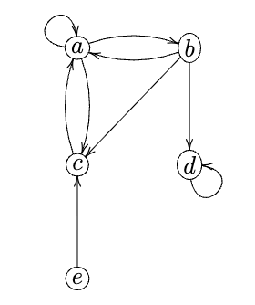
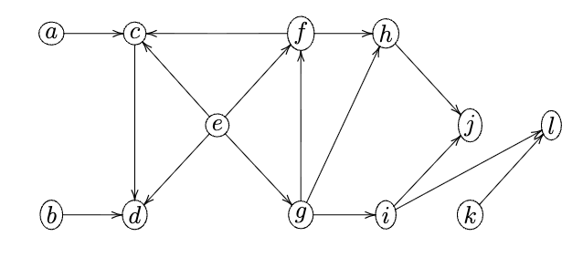

**CS217 Data Structures and Algorithm Analysis**
**Fall term 2025**

# Exercise Sheet 14
**Handout:** December 9th **Deadline:** December 16th, 4pm

-----

### Question 14.1 (0.25 marks)

Perform a depth-first search on the following graph visiting nodes in alphabetical order. Assume that all adjacency lists are sorted alphabetically. Write down the timestamps and the $\pi$-value of each node.




### Answer: 

adjacency list:
a: a, b, c
b: a, c, d
c: a
d: d
e: c

Starting DFS from vertex a:
- Vertex a: \( time = 1/ , \pi = \text{NULL}, color = \text{gray} \)
- Vertex b: \( time = \infty, \pi = \text{NULL}, color = \text{white} \)
- Vertex c: \( time = \infty, \pi = \text{NULL}, color = \text{white} \)
- Vertex d: \( timed = \infty, \pi = \text{NULL}, color = \text{white} \)
- Vertex e: \( time = \infty, \pi = \text{NULL}, color = \text{white} \)

We explore the vertices in the following order:

Visit vertex a.
- Explore neighbors of a: a, b, c
    - Skip neighbor a since it has already been visited.
    - Mark b as visited with timestamp 2 and set its parent to a.
    - Vertex b: \( time = 2/ , \pi = \text{a}, color = \text{grey} \)
    - Explore neighbors of b: a, c, d
        - Skip neighbor a since it has already been visited.
        - Mark c as visited with timestamp 3 and set its parent to b.
        - Vertex c: \( time = 3/, \pi = \text{b}, color = \text{grey} \)
            - Explore neighbors of c: a
            - Skip neighbor a since it has already been visited.
            - Mark c as black and finish at timestamp 4. 
            - Vertex c: \( time = 3/4, \pi = \text{b}, color = \text{black} \)
            - Backtrack to vertex b.
        - Mark d as visited with timestamp 5 and set its parent to b.
        - Vertex d: \( time = 5/, \pi = \text{b}, color = \text{grey} \)
             - Explore neighbors of d: d
            - Skip neighbor d since it has already been visited.
            - Mark d as black and finish at timestamp 6. 
            - Vertex d: \( time = 5/6, \pi = \text{b}, color = \text{black} \)
            - Backtrack to vertex b.
        - Mark b as black and finish at timestamp 7. 
        - Vertex b: \( time = 2/7, \pi = \text{a}, color = \text{black} \)
    - Backtrack to vertex a.
    - Skip neighbor c since it has already been visited.
    - Mark a as black and finish at timestamp 8. 
    - Vertex a: \( time = 1/8 , \pi = \text{NULL}, color = \text{black} \)

visit vertex e.
- Mark e as visited with timestamp 9 and set its parent to NULL.
- Vertex e: \( time = 9/ , \pi = \text{NULL}, color = \text{grey} \)
    - Explore neighbors of e: c
    - Skip neighbor c since it has already been visited.
    - Mark e as black and finish at timestamp 10.
    - Vertex e: \( time = 9/10 , \pi = \text{NULL}, color = \text{black} \)
    
After DFS traversal completes, we have the following timestamps and $\pi$ values for each vertex:
- Vertex a: \( time = 1/8 , \pi = \text{NULL}, color = \text{black} \)
- Vertex b: \( time = 2/7, \pi = \text{a}, color = \text{black} \)
- Vertex c: \( time = 3/4, \pi = \text{b}, color = \text{black} \)
- Vertex d: \( time = 5/6, \pi = \text{b}, color = \text{black} \)
- Vertex e: \( time = 9/10 , \pi = \text{NULL}, color = \text{black} \)

-----

### Question 14.2 (0.5 marks)

Prove or refute the following claim: if some depth-first search on a directed graph yields precisely one back edge, then all depth-first searches on this graph yield precisely one back edge.


### Answer:

The statement is false. Consider the following counterexample:

adjacency list:
A: B
B: C
C: A, B

Performing a depth-first search (DFS) starting from vertex A:
- Start at A: mark A as gray.
    - Explore neighbor B: mark B as gray.
        - Explore neighbor C: mark C as gray.
            - Explore neighbor A: A is gray, so we have found a back edge (C -> A).
            - Explore neighbor B: B is gray, so we have found another back edge (C -> B).
            - Mark C as black.
        - Mark B as black.
    - Mark A as black.
In this DFS traversal, we found two back edges: (C -> A) and (C -> B).

Now, let's perform a DFS starting from vertex C:
- Start at C: mark C as gray.
    - Explore neighbor A: mark A as gray.
        - Explore neighbor B: mark B as gray.
            - Explore neighbor C: C is gray, so we have found a back edge (B -> C).
            - Mark B as black.
        - Mark A as black.
    - Explore neighbor B: B is black, (C -> B) is a forward edge, not a back edge.
    - Mark C as black.
In this DFS traversal, we found only one back edge: (B -> C).

-----

### Question 14.3 (0.25 marks)

Run TOPOLOGICAL-SORT on the following directed acyclic graph. Assume that depth-first search visits nodes in alphabetical order and that adjacency lists are sorted alphabetically. 



### Answer:

We start by initializing the vertices with their respective properties:

adjacency list:
a: c
b: d
c: d
d: 
e: c, d, f, g
f: c, h
g: f, h, i
h: j
i: j, l
j: 
k: l
l: 

- Vertex a: \( time = \infty , \pi = \text{NULL}, color = \text{gray} \)
- Vertex b: \( time = \infty, \pi = \text{NULL}, color = \text{white} \)
- Vertex c: \( time = \infty, \pi = \text{NULL}, color = \text{white} \)
- Vertex d: \( timed = \infty, \pi = \text{NULL}, color = \text{white} \)
- Vertex e: \( time = \infty, \pi = \text{NULL}, color = \text{white} \)
- Vertex f: \( time = \infty, \pi = \text{NULL}, color = \text{white} \)
- Vertex g: \( time = \infty, \pi = \text{NULL}, color = \text{white} \)
- Vertex h: \( time = \infty, \pi = \text{NULL}, color = \text{white} \)
- Vertex i: \( time = \infty, \pi = \text{NULL}, color = \text{white} \)
- Vertex j: \( time = \infty, \pi = \text{NULL}, color = \text{white} \)
- Vertex k: \( time = \infty, \pi = \text{NULL}, color = \text{white} \)
- Vertex l: \( time = \infty, \pi = \text{NULL}, color = \text{white} \)

Initialize an empty list to hold the topological order.
List L = []
Call DFS on the graph:
Starting DFS from vertex a:

- Explore neighbors of a: c
    - Mark c as visited with timestamp 1 and set its parent to a.
    - Vertex c: \( time = 1/ , \pi = \text{a}, color = \text{grey} \)
        - Explore neighbors of c: d
            - Mark d as visited with timestamp 2 and set its parent to c.
            - Vertex d: \( time = 2/ , \pi = \text{c}, color = \text{grey} \)
                - d has no neighbors.
                - Mark d as black and finish at timestamp 3.
                - Vertex d: \( time = 2/3, \pi = \text{c}, color = \text{black} \)
                - Insert d at the front of L. List L = [d].
            - Backtrack to vertex c.
        - Mark c as black and finish at timestamp 4. 
        - Vertex c: \( time = 1/4, \pi = \text{a}, color = \text{black} \)
        - Insert c at the front of L. List L = [c, d].
    - Backtrack to vertex a.
- Mark a as black and finish at timestamp 5. 
- Vertex a: \( time = 0/5 , \pi = \text{NULL}, color = \text{black} \)
- Insert a at the front of L. List L = [a, c, d].

Continuing DFS from vertex b:
- mark b as visited with timestamp 6 and set its parent to NULL.
- Vertex b: \( time = 6/ , \pi = \text{NULL}, color = \text{grey} \)
    - Explore neighbors of b: d
    - d is already black, so no update.
- Mark b as black and finish at timestamp 7. 
- Vertex b: \( time = 6/7 , \pi = \text{NULL}, color = \text{black} \)
- Insert b at the front of L. List L = [b, a, c, d].

Continuing DFS from vertex e:
- mark e as visited with timestamp 8 and set its parent to NULL.
- Vertex e: \( time = 8/ , \pi = \text{NULL}, color = \text{grey} \)
    - Explore neighbors of e: c, d, f, g
    - c is already black, so no update.
    - d is already black, so no update.
    - Mark f as visited with timestamp 9 and set its parent to e.
    - Vertex f: \( time = 9/ , \pi = \text{e}, color = \text{grey} \)
        - Explore neighbors of f: c, h
        - c is already black, so no update.
        - Mark h as visited with timestamp 10 and set its parent to f.
        - Vertex h: \( time = 10/ , \pi = \text{f}, color = \text{grey} \)
            - Explore neighbors of h: j
            - Mark j as visited with timestamp 11 and set its parent to h.
            - Vertex j: \( time = 11/ , \pi = \text{h}, color = \text{grey} \)
                - j has no neighbors.
                - Mark j as black and finish at timestamp 12. 
                - Vertex j: \( time = 11/12, \pi = \text{h}, color = \text{black} \)
                - Insert j at the front of L. List L = [j, b, a, c, d].
            - Backtrack to vertex h.
        - Mark h as black and finish at timestamp 13. 
        - Vertex h: \( time = 10/13, \pi = \text{f}, color = \text{black} \)
        - Insert h at the front of L. List L = [h, j, b, a, c, d].
        - Backtrack to vertex f.
    - Mark f as black and finish at timestamp 14. 
    - Vertex f: \( time = 9/14, \pi = \text{e}, color = \text{black} \)
    - Insert f at the front of L. List L = [f, h, j, b, a, c, d].
    - Backtrack to vertex e.
    - Mark g as visited with timestamp 15 and set its parent to e.
    - Vertex g: \( time = 15/ , \pi = \text{e}, color = \text{grey} \)
        - Explore neighbors of g: f, h, i
        - f is already black, so no update.
        - h is already black, so no update.
        - Mark i as visited with timestamp 16 and set its parent to g.
        - Vertex i: \( time = 16/ , \pi = \text{g}, color = \text{grey} \)
            - Explore neighbors of i: j, l
            - j is already black, so no update.
            - Mark l as visited with timestamp 17 and set its parent to i.
            - Vertex l: \( time = 17/ , \pi = \text{i}, color = \text{grey} \)
                - l has no neighbors.
                - Mark l as black and finish at timestamp 18. 
                - Vertex l: \( time = 17/18, \pi = \text{i}, color = \text{black} \)
                - Insert l at the front of L. List L = [l, f, h, j, b, a, c, d].
            - Backtrack to vertex i.
        - Mark i as black and finish at timestamp 19. 
        - Vertex i: \( time = 16/19, \pi = \text{g}, color = \text{black} \)
        - Insert i at the front of L. List L = [i, l, f, h, j, b, a, c, d].
        - Backtrack to vertex g.
    - Mark g as black and finish at timestamp 20. 
    - Vertex g: \( time = 15/20, \pi = \text{e}, color = \text{black} \)
    - Insert g at the front of L. List L = [g, i, l, f, h, j, b, a, c, d].
    - Backtrack to vertex e.
- Mark e as black and finish at timestamp 21. 
- Vertex e: \( time = 8/21 , \pi = \text{NULL}, color = \text{black} \)
- Insert e at the front of L. List L = [e, g, i, l, f, h, j, b, a, c, d].

Continuing DFS from vertex k:
- mark k as visited with timestamp 22 and set its parent to NULL.
- Vertex k: \( time = 22/ , \pi = \text{NULL}, color = \text{grey} \)
    - Explore neighbors of k: l
    - l is already black, so no update.
- Mark k as black and finish at timestamp 23. 
- Vertex k: \( time = 22/23 , \pi = \text{NULL}, color = \text{black} \)
- Insert k at the front of L. List L = [k, e, g, i, l, f, h, j, b, a, c, d].

Finally we have completed the DFS traversal. The topological order is given by the list L:
Topological Sort Order: [k, e, g, i, l, f, h, j, b, a, c, d]

-----

### Question 14.4 (0.5 marks)

Recall from the lecture that DFS can be used to check whether a directed graph $G=(V,E)$ is acyclic or not, and that DFS runs in time $\Theta(|V|+|E|)$. 

Give an algorithm that checks whether or not an undirected graph $G=(V,E)$ is acyclic and that runs in time only $O(|V|)$.

### Answer:

Intuitively, for an undirected graph, if $|E| \geq |V|$, then the graph must contain at least one cycle. 

```
For edge in adjacency_list:
    count += 1
    if count == |V|:
        return "Cyclic"
```

During the counting, if the count reaches ∣V∣, stop immediately and return "Cyclic". If the count finishes and ∣E∣<∣V∣, run the standard DFS cycle detection algorithm. If DFS finds a back edge, return "Cyclic". Otherwise, return "Acyclic".

Time Complexity Analysis:

Step 1: We process at most ∣V∣ edges. If the graph has more edges, we terminate early. Thus, this step takes O(∣V∣).

Step 2: This step runs standard DFS, which takes O(∣V∣+∣E∣). However, this step is only executed when ∣E∣<∣V∣. Substituting ∣E∣, the runtime becomes O(∣V∣+∣V∣)=O(∣V∣).

Total Time: O(∣V∣).

