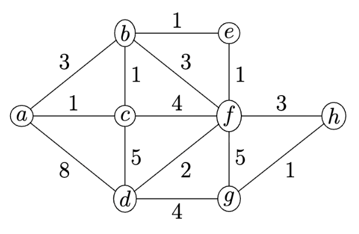
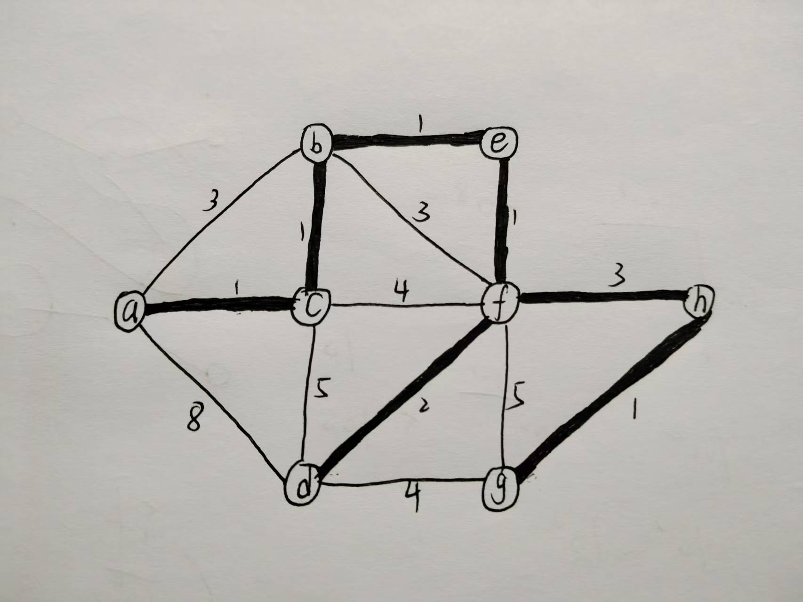
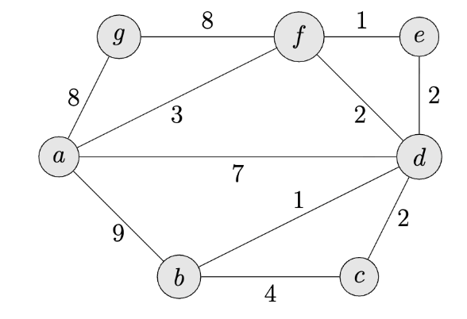

CS217 Data Structures and Algorithm Analysis 

**Exercise Sheet 15** 

## Question 15.1 (0.25 marks) 

Compute the minimum spanning tree of the following weighted graph both with Prim's and Kruskal's algorithm. List the edges in the order considered, draw the tree and calculate its weight. 

#### Kruskal's algorithm

The idea of Kruskal's algorithm is to sort all edges in non-decreasing order of their weight, choose the smallest edge whose two vertices belong to different trees and merge two trees.

1. Sort edges by weight: (b, e)=1, (a, c)=1, (b, c)=1, (e, f)=1, (g, h)=1, (d, f)=2, (a, b)=3, (b, f)=3, (f, h)=3, (c, f)=4, (d, g)=4, (c, d)=5, (f, g)=5, (a, d)=8
2. Initialize forest with each vertex as a separate tree.
3. choose edges in sorted order, adding them to the forest if they connect two different trees:
   - Add (b, e)=1
   - Add (a, c)=1
   - Add (b, c)=1
   - Add (e, f)=1
   - Add (g, h)=1
   - Add (d, f)=2
   - Skip (a, b)=3 (creates a cycle)
   - Skip (b, f)=3 (creates a cycle)
   - Add (f, h)=3
   - Skip (c, f)=4 (creates a cycle)
   - Skip (d, g)=4 (creates a cycle)
   - Skip (c, d)=5 (creates a cycle)
   - Skip (f, g)=5 (creates a cycle)
   - Skip (a, d)=8 (creates a cycle)

total weight = 1 + 1 + 1 + 1 + 1 + 2 + 3 = 10
The result is:

#### Prim's algorithm

The idea of Prim's algorithm is to start from an arbitrary vertex and grow the minimum spanning tree by adding the smallest edge that connects a vertex in the tree to a vertex outside the tree.

Edges: (b, e)=1, (a, c)=1, (b, c)=1, (e, f)=1, (g, h)=1, (d, f)=2, (a, b)=3, (b, f)=3, (f, h)=3, (c, f)=4, (d, g)=4, (c, d)=5, (f, g)=5, (a, d)=8

1. Start from vertex a.
2. Add edge (a, c)=1
3. Add edge (b, c)=1
4. Add edge (b, e)=1
5. Add edge (e, f)=1
6. Add edge (d, f)=2
7. Add edge (f, h)=3
8. Add edge (g, h)=1

The result is the same as Kruskal's algorithm, with total weight = 10. 

---

## Question 15.2 (0.25 marks) 

Execute Dijkstra's algorithm on the following weighted graph to find a shortest path from vertex a to c. Show for each iteration of the while loop which vertex is added to the set S and how the distance estimates of adjacent vertices are being refined. 

Edges: (a, b)=9, (a, f)=3, (a, g)=8, (b, c)=4, (b, d)=1, (a, d)=7, (c, d)=2, (g, f)=8, (f, d)=2, (f, e)=1, (e, d)=2

Initialization:
- S = {}
- Q = {a=0, b=∞, c=∞, d=∞, e=∞, f=∞, g=∞}
- Distance estimates: d(a)=0, d(b)=∞, d(c)=∞, d(d)=∞, d(e)=∞, d(f)=∞, d(g)=∞

1. Add a to S:
   - Update distances: d(b)=9, d(f)=3, d(g)=8, d(d)=7
   - S = {a}
   - Q = {f=3, d=7, g=8, b=9, e=∞, c=∞}
2. Add f to S
   - Update distances: d(d)=5, d(e)=4
   - S = {a, f}
   - Q = {e=4, d=5, g=8, b=9, c=∞}
3. Add e to S
   - Update distances: none
   - S = {a, f, e}
   - Q = {d=5, g=8, b=9, c=∞}
4. Add d to S
   - Update distances: d(c)=7, d(b)=6
   - S = {a, f, e, d}
   - Q = {b=6, c=7, g=8}
5. Add b to S
   - Update distances: none
   - S = {a, f, e, d, b}
   - Q = {c=7, g=8}
6. Add c to S
   - Update distances: none
   - S = {a, f, e, d, b, c}
   - Q = {g=8}

The shortest path from a to c is a -> f -> d -> c with a total weight of 7.

---

## Question 15.3 (0.5 marks) 

A precondition for Dijkstra's algorithm is that all edges of the directed graph under consideration have non-negative weight. Somebody on the internet claims that the algorithm works for graphs with negative edge weights as well: just add an appropriate constant c to each edge weight to make all weights positive, then run Dijksta's algorithm, and finally remove the constants from the shortest paths computed.  Give a directed acyclic graph as a counterexample to falsify this claim. Explain in your own words what goes wrong. 

### Answer:

This claim is wrong because adding a constant to each edge weight can change the relative weights of different paths with different numbers of edges, leading to incorrect shortest path calculations.

Consider the following directed acyclic graph:

Edges: (s, b) = 2, (s, a) = 1, (a, b) = -2

If we run Dijkstra's algorithm directly on this graph starting from vertex s, we find the shortest path to b is s -> a -> b with a total weight of -1.

Now, let's add a constant c = 5 to each edge weight to make all weights positive: 
Edges after adding c: (s, b) = 7, (s, a) = 6, (a, b) = 3

Running Dijkstra's algorithm on this modified graph starting from vertex s, we find the shortest path to b is s -> b with a total weight of 7.

This is because the originally correct path include two edges, leading to more punishhment when we add the constant, while the direct edge from s to b is less affected.