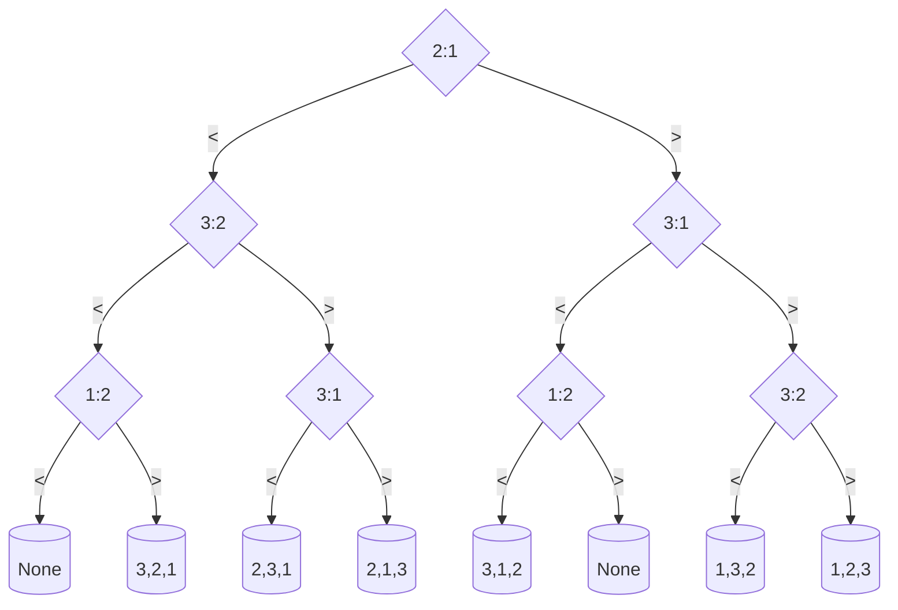

# Exercise Sheet 6
**Handout: Oct 14th — Deadline: Oct 23rd - 4pm**

---

### **Question 6.1** (marks 0.5)
Consider the following algorithm. Does it sort correctly? (You might want to work out your own example to understand this better.)

**DO-I-SORT(A, n)**
```
for i = 1 to n do
    for j = 1 to n do
        if A[i] < A[j] then
            exchange A[i] with A[j]
```

1. If the algorithm is correct prove its correctness by loop invariant. Otherwise argue why it is not correct eg., provide an instance where it fails.
2. State the runtime of the algorithm in asymptotic notation. Justify your answer.

#### Answer

1. The algorithm is correct.
    The loop invariant is: **before the ith iteration in line 1, the subarray A[1..i-1] is sorted in descending order**
    - **Initialization**: before the first iteration, the subarray A[1..0] is empty and sorted naturally.

    - **Maintenance**: before the ith iteration in line 1, the subarray A[1..i-1] is sorted in ascending order. Then in the ith iteration, we fix i and move j from 1 to n, and exchage A[i] and A[j] if A[i] < A[j]. When A[i] > A[j], we just increment j util we find an element A[r] that is larger than A[i], then for all elements in A[r...i-1], we use an extra position i to help with exchanging each element A[j] with A[i] incrementally, which eccensially put the original element A[i] to the right place r and move elements in A[j...i-1] to right by one position. Finally A[r] is larger than elements in A[1..r-1] and smaller than elements in A[r+1,i], so the subarray A[1..i] is sorted in ascending order.
  
    - **termination**: The loop end at i = n+1, which means the array A[1..n] is sorted in ascending order.
2. The runtime of the algorithm is $\Theta(n^2)$ because we have two loops, each loop runs n times.

---

### **Question 6.2** (0.5 marks)
Consider the following input for RANDOMIZED-QUICKSORT:

| 12 | 10 | 4 | 2 | 9 | 6 | 5 | 25 | 8 |
|----|----|---|---|---|---|---|----|---|

What is the probability that:
1. The elements A[2] = 10 and A[3] = 4 are compared?
2. The elements A[1] = 12 and A[8] = 25 are compared?
3. The elements A[4] = 2 and A[8] = 25 are compared?
4. The elements A[2] = 10 and A[7] = 5 are compared?

#### Answer
Let's denote $Z_i$ as the ith element in the sorted array.

| 2 | 4 | 5 | 6 | 8 | 9 | 10 | 12 | 25 |
|----|----|---|---|---|---|---|----|---|

The probability that the elements $Z_i$ and $Z_j$ are compared is $\frac{2}{j-i+1}$
1. $\frac{2}{6}=0.33$
2. $\frac{2}{2}=1$
3. $\frac{2}{9}=0.22$
4.  $\frac{2}{5}=0.4$

---

### **Question 6.3** (1 mark)
Prove that the expected runtime of RANDOMIZED-QUICKSORT is $\Omega (n log n)$.
*(HINT: It may be useful to consider how long it takes to compare n/2 elements to achieve a lower bound on the runtime.)*

#### Answer
As illustrated in the lecture,we already know that $T(n) = \Theta (X(n))$. the probability that $Z_i$ and $Z_j$ is compaired is $Pr(ij) = \frac{2}{j-i+1}$ and the expected number of comparisons is $\mathbb{E}(X) = \sum_{i=1}^{n-1} \sum_{j=i+1}^{n} Pr(ij) =\sum_{i=1}^{n-1} \sum_{j=i+1}^{n} \frac{2}{j-i+1}$.
>We only need to prove that $\mathbb{E}(X) \ge c n \log n$ for some constant $c>0$.

Re-index by distance \(d=j-i\ge 1\):
\[
\mathbb{E}[X]
\;=\; \sum_{d=1}^{n-1} \sum_{i=1}^{n-d} \frac{2}{d+1}
\;=\; \sum_{d=1}^{n-1} \frac{2(n-d)}{d+1}
\;=\; 2\sum_{d=1}^{n-1} \frac{n+1-(d+1)}{d+1}
\;=\; 2\sum_{d=1}^{n-1} (\frac{n+1}{d+1}-1)\\
\;=\; 2(n+1) \sum_{d=1}^{n-1} \frac{1}{d+1} -2 \sum_{d=1}^{n-1} 1
\;=\; 2(n+1) \sum_{k=2}^{n}\frac{1}{k}-2(n-1)
\;=\; 2(n+1)\,(H_n - 1)-2(n-1),
\]
where \(H_n=\sum_{k=1}^n \frac{1}{k}  \ge \int_1^{n+1} \frac{1}{x}\, dx=\ln(n+1)\), Hence= \(H_n=\Omega (\log n)\).
\[
\mathbb{E}[X] \;=\; \Omega(n \log n).
\]

This completes the lower bound for the expected number of comparisons, and therefore for the expected runtime.

---

### **Question 6.4** (1 mark)
Draw the decision tree that reflects how SELECTIONSORT sorts n = 3 elements. Assume that all elements are mutually distinct.

For convenience here's the pseudocode again:

**SELECTION-SORT(A)**
```
1: n = A.length
2: for j = 1 to n - 1 do
3:   smallest = j
4:   for i = j + 1 to n do
5:     if A[i] < A[smallest] then smallest = i
6:   exchange A[j] with A[smallest]
```
### Answer
The decision tree will look like this:


But actually there are some cases that are impossible. For example, the left most node should be none because 2<1 and 1<2 both exists in the decision path.

---

### **Question 6.5** (0.5 marks)
What is the smallest possible depth of a leaf in a decision tree for a comparison sort?

#### Answer
The smallest possible depth of a leaf in a decision tree for a comparison sort is the number of comparisons in the best case. 
> So wee need to find the lower bound for the best case.
> 
The best case takes place when the array is already sorted, and we compare all emelents one by one in a chain, and using the transitivities of inequalities to show that they are sorted. The running time is $\Theta(n)$,so the smallest possible depth of a leaf in a decision tree for a comparison sort is $\Theta(n)$.