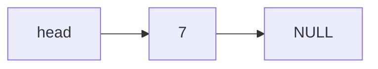
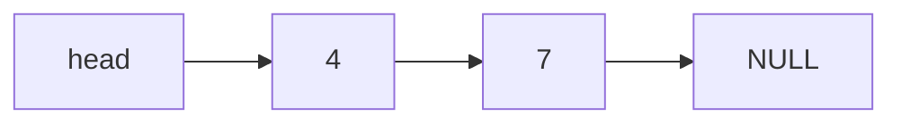
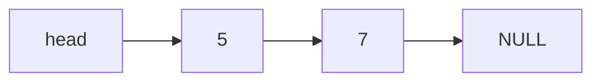
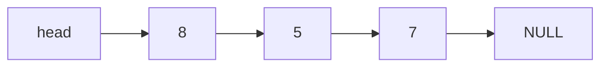
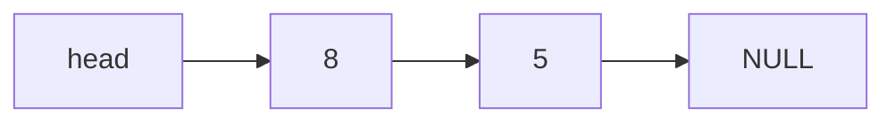

# Exercise Sheet 8
Handout: Oct 28th — Deadline: Nov 4th 4pm

**Question 8.1 (0.25 marks)**
Draw the following data structures after each of the following operations. Assume that the data structures are initially empty. You don't need to draw pointers for stacks and queues.

1. Consider a stack $S$ and the operations $\text{PUSH}(S, 7)$, $\text{PUSH}(S, 4)$, $\text{PUSH}(S, 5)$, $\text{POP}(S)$, $\text{PUSH}(S, 8)$, $\text{POP}(S)$, $\text{POP}(S)$.
```
PUSH(S, 7)
[7]
PUSH(S, 4)
[4]
[7]
PUSH(S, 5)
[5]
[4]
[7]
POP(S)
[4]
[7]
PUSH(S, 8)
[8]
[4]
[7]
POP(S)
[4]
[7]
POP(S)
[7]
``` 
2. Consider a queue $Q$ and the operations $\text{ENQUEUE}(Q, 7)$, $\text{ENQUEUE}(Q, 4)$, $\text{ENQUEUE}(Q, 5)$, $\text{DEQUEUE}(Q)$, $\text{ENQUEUE}(Q, 8)$, $\text{DEQUEUE}(Q)$, $\text{DEQUEUE}(Q)$.
```
ENQUEUE(Q, 7)
[7]
ENQUEUE(Q, 4)
[7, 4]
ENQUEUE(Q, 5)
[7, 4, 5]
DEQUEUE(Q)
[4, 5]
ENQUEUE(Q, 8)
[4, 5, 8]
DEQUEUE(Q)
[5, 8]
DEQUEUE(Q)
[8]
```
3. Consider a singly-linked list $L$ and the operations $\text{LIST-PREPEND}(L, 7)$, $\text{LIST-PREPEND}(L, 4)$, $\text{LIST-PREPEND}(L, 5)$, $\text{LIST-DELETE}(L, 4)$, $\text{LIST-PREPEND}(L, 8)$, $\text{LIST-DELETE}(L, 7)$, $\text{LIST-DELETE}(L, 8)$.








**Question 8.2 (0.5 marks)** Explain how to implement two stacks $S_1$ and $S_2$ in one array $A[1:n]$ in such a way that neither stack overflows unless all the $n$ elements of $A$ are full. Present the pseudocodes for operations $\text{PUSH}S_1(A, x)$, $\text{PUSH}S_2(A, x)$, $\text{POP}S_1(A)$, and $\text{POP}S_2(A)$.

We can implement two stacks in a single array by letting one stack grow from the beginning of the array (stack $S_1$) and the other stack grow from the end of the array (stack $S_2$). We maintain two pointers, `top1` for stack $S_1$ and `top2` for stack $S_2$. Initially, `top1` is set to 0 (indicating that stack $S_1$ is empty) and `top2` is set to `n + 1` (indicating that stack $S_2$ is empty). 

When we push an element onto stack $S_1$, we increment `top1` and place the element at `A[top1]`. When we push an element onto stack $S_2$, we decrement `top2` and place the element at `A[top2]`.
```
// PUSH S1(A, x)
PUSH_S1(A, x)
1  if top1 + 1 == top2
2      error "overflow"
3  top1 = top1 + 1
4  A[top1] = x

// PUSH S2(A, x)
PUSH_S2(A, x)
1  if top1 + 1 == top2
2      error "overflow"
3  top2 = top2 - 1
4  A[top2] = x

// POP S1(A)
POP_S1(A)
1  if top1 == 0
2      error "underflow"
3  x = A[top1]
4  top1 = top1 - 1
5  return x

// POP S2(A)
POP_S2(A)
1  if top2 == n + 1
2      error "underflow"
3  x = A[top2]
4  top2 = top2 + 1
5  return x
```


**Question 8.3 (0.25 marks)** Rewrite $\text{ENQUEUE}$ and $\text{DEQUEUE}$ to detect underflow and overflow of a queue.

We can maintain a count of the number of elements in the queue to detect underflow and overflow. If the count equals the size of the queue, we have an overflow when trying to enqueue. If the count is zero, we have an underflow when trying to dequeue.
```
ENQUEUE(Q, x)
1  if Q.count == Q.size
2      error "overflow"
3  Q[Q.tail] = x
4  if Q.tail == Q.size
5     Q.tail = 1
6  else
7     Q.tail = Q.tail + 1
8  Q.count = Q.count + 1

DEQUEUE(Q)
1  if Q.count == 0
2      error "underflow"
3  x = Q[Q.head]
4  if Q.head == Q.size
5     Q.head = 1
6  else
7     Q.head = Q.head + 1
8  Q.count = Q.count - 1
9  return x

```
**Question 8.4 (0.5 marks)** Show how to implement a Queue using 2 stacks $S_1$ and $S_2$. Provide the pseudo-code of the operations $\text{ENQUEUE}$ and $\text{DEQUEUE}$. You don't need to check for underflow and overflow. Analyse the runtime of the two operations.

We can implement a queue using two stacks by using one stack for enqueue operations and the other stack for dequeue operations. The idea is to reverse the order of elements when transferring them from one stack to the other.

```
// ENQUEUE(Q, x)
ENQUEUE(Q, x)
1  PUSH_S1(Q.S1, x)

// DEQUEUE(Q)
DEQUEUE(Q)
1  if S2 is empty
2      while S1 is not empty
3          x = POP_S1(Q.S1)
4          PUSH_S2(Q.S2, x)
5  return POP_S2(Q.S2)
```

The time complexity for ENQUEUE operations is O(1). However, the worst-case time complexity for DEQUEUE is O(n) when all elements are transferred from S1 to S2.

**Question 8.5 (0.5 marks)** Implement an Integer Calculator that takes a postfix expression in input using integers as operands and $\{+, -, *\}$ as operators. The algorithm should use a stack. (See Judge)

```
POSTFIX-CALCULATOR(expression)
1  create an empty stack S
2  for each token t in expression do
3      if t is an integer then
4          PUSH(S, t)
5      else if t is an operator then
6          operand2 = POP(S)
7          operand1 = POP(S)
8          result = APPLY-OPERATOR(t, operand1, operand2)
9          PUSH(S, result)
10 return POP(S)
```