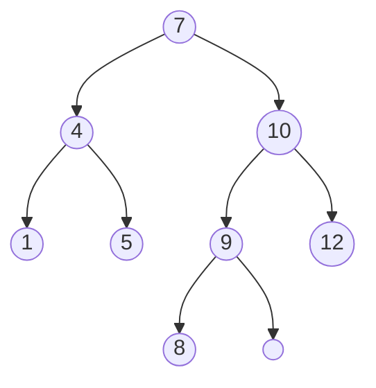
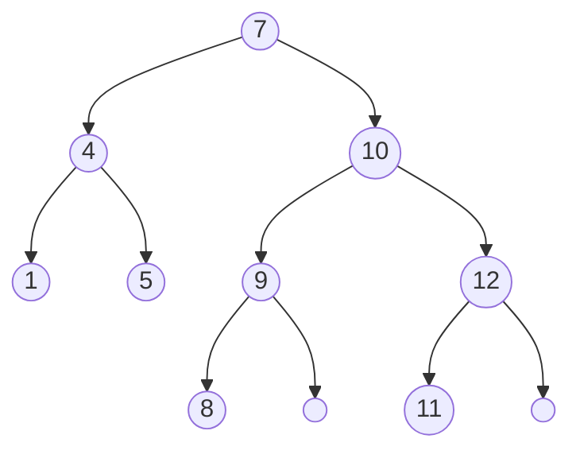
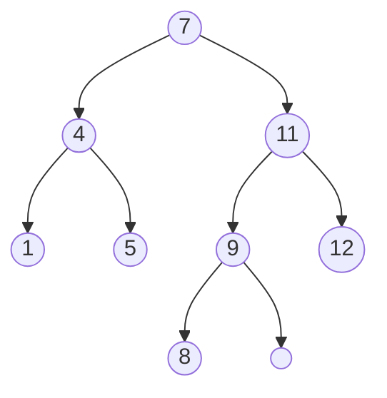
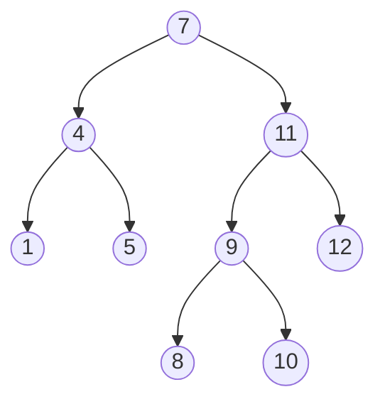
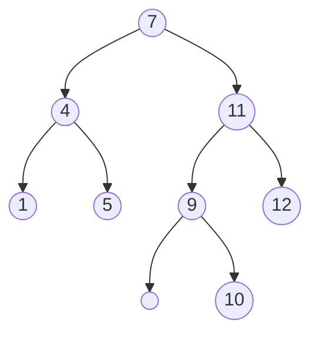
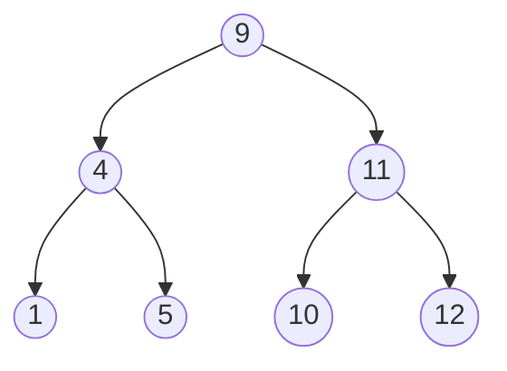

# Exercise Sheet 9
**Handout**: Nov 4th — **Deadline**: Nov 11th, 4pm

---

### **Question 9.1** (1 mark)

1.  Prove by induction that every complete binary tree of height *h* has 2<sup>*h*</sup> − 1 internal nodes.
2.  Prove by induction that in every full nonempty binary tree the number of leaves is one more than the number of internal nodes.
3.  Prove by induction that every nonempty binary tree satisfies |*V*| = |*E*| + 1.

#### Answers
1. **Base Case**: For height *h* = 1, a complete binary tree has 2<sup>1</sup> - 1 = 1 internal node, which is true.

   **Inductive Step**: Assume that for height *k*, a complete binary tree has 2<sup>*k*</sup> - 1 internal nodes. For height *k* + 1, the tree will have two subtrees of height *k*, each with 2<sup>*k*</sup> - 1 internal nodes. Therefore, the total number of internal nodes is:

   2 * (2<sup>*k*</sup> - 1) + 1 = 2<sup>*k* + 1</sup> - 1.

   Thus, by induction, the statement holds for all heights *h*.

2. **Base Case**: For a full binary tree with 1 internal node, there are 2 leaves, which is true.

   **Inductive Step**: Assume that for a full binary tree with *k* internal nodes, there are *k* + 1 leaves. When we add one more internal node, it will add two new leaves and convert one existing leaf into an internal node. Therefore, the number of leaves becomes:

   (*k* + 1) + 2 - 1 = *k* + 2.

   Thus, by induction, the statement holds for all full nonempty binary trees.

3. **Base Case**: For a tree with 1 node, there are 0 edges, so |*V*| = 1 and |*E*| = 0, which satisfies |*V*| = |*E*| + 1.
    **Inductive Step**: Assume that for a tree with *k* nodes, |*V*| = |*E*| + 1 holds. When we add one more node, we also add one edge connecting it to the tree. Therefore, the new counts are:
    
    |*V*| = *k* + 1 and |*E*| = *k*.
    
    Thus, |*V*| = |*E*| + 1 still holds. By induction, the statement is true for all nonempty binary trees.

---

### **Question 9.2** (0.25 marks)

1.  Insert a node with key 11 into the following binary search tree. Give a step-by-step explanation.


Insert a node with key 11 into the binary search tree is like find the position of the new node and attach it there. Here are the steps:
- Start at the root node (7). Since 11 is greater than 7, we go right
- Move to the right child (10). Since 11 is greater than 10, we go right
- Move to the right child (12). Since 11 is less than 12, we insert the new node (11) at the left child of node (12).The result is:


2. Delete the node with key 10 into the resulting binary search tree. Give a step-by-step explanation.

To delete the node with key 10 from the binary search tree, we follow these steps:

- Since node (10) has two children, we need to find its in-order successor, which is the minimum node in its right subtree (node 11).
- Node 11 isn't a direct child of node (10), so we first transplant node (11)'s right child (which is null) to replace node (11)
- Then we transplant node (11) to replace node (10).The result is:



3.  Insert a node with key 10 into the resulting binary search tree. Give a step-by-step explanation.

- Start at the root node (7). Since 10 is greater than 7, we go right
- Move to the right child (11). Since 10 is less than 10, we go left
- Move to the left child (9). Since 10 is greater than 9, we insert the new node (10) at the right child of node (9).The result is:



4.  Delete the node with key 8 from the resulting binary search tree. Give a step-by-step explanation.

Since node (8) is a leaf node, we can simply remove it from the tree. The result is:


5.  Delete the node with key 7 from the resulting binary search tree. Give a step-by-step explanation.

- Since node (7) has two children, we need to find its in-order successor, which is the minimum node in its right subtree (node 9).
- Node 9 isn't a direct child of node (7), so we first transplant node (9)'s right child (which is node 10) to replace node (9)
- Then we transplant node (9) to replace node (7).The result is:


---

### **Question 9.3** (0.25 marks)

Delete two different nodes in different order from a binary search tree (e.g. first node *x* and then node *y*, or alternatively first node *y* and then node *x*). Can the resulting trees be different? Explain your answer.

Yes, the resulting trees can be different depending on the order in which the nodes are deleted. This is because the deletion of a node can affect the structure of the tree, particularly when the node being deleted has two children.

For example, consider the following binary search tree:
```
1
 \
  2
   \
    4
   / \
  3   6
     /
    5

```

If we delete 3 than 4, the resulting tree will be:
- first remove 3 directly because it is a leaf node
- then to remove 4, we transplant subtree rooted at 6 to replace 4, the subtree's structure remains unchanged
```
1                           1
 \                           \
  2                           2
   \                           \
    4          --->             6
     \                         /
      6                       5
     /
    5

```
If we delete 4 than 3, the resulting tree will be:
- first to remove 4. Because 4 has two children, we find its in-order successor, which is 5. Subtree rooted at 5 only has one node, so we simply transplant 5 to 4
- then remove 3 directly because it is a leaf node
```
1                          1    
 \                          \
  2                          2
   \                          \
    5           --->           5
   / \                          \
  3   6                          6

```
Second situation modify the subtree \{6,5\} structure to a linear form, while the first situation keeps its original structure. This is because when deleting a node with two childs, the procedure of finding and transplanting the in-order successor can lead to different tree structures based on the order of deletions.

---

### **Question 9.4** (0.25 marks)

Write the TREE-PREDECESSOR(*x*) procedure.
```
TREE-PREDECESSOR(x)
    if x.left ≠ NIL
        return TREE-MAXIMUM(x.left)
    y = x.p
    while y ≠ NIL and x == y.left
        x = y
        y = y.p
    return y
```
---

### **Question 9.5** (0.25 marks)

You can sort a set of *n* numbers by the following procedure:

1.  Build a binary search tree by inserting each element using TREE-INSERT (*n* times)
2.  Print the numbers in sorted order by an INORDER tree walk.

What are the worst case and best case runtimes of this sorting algorithm?

#### Answers
**Worst Case**: The worst-case runtime occurs when the binary search tree becomes unbalanced, as a linked list. This happens when the input numbers are already sorted (either in ascending or descending order). In this case, each insertion takes s+1 time (s is the number of elements already inserted), leading to a total time complexity of $\sum_{s=1}^{n} s =\frac{n(n-1)}{2} = \Theta(n^2)$ for building the tree. The INORDER tree walk takes $\Theta(n)$ time, so the overall worst-case runtime is $\Theta(n^2)$.

**Best Case**: The best-case runtime occurs when the input numbers are inserted in a random order, leading to a balanced binary search tree. In this case, each insertion time is similar to the height h of the tree, which is about $h = \Theta(logn)$, leading to a total time complexity of $\Theta(nlogn)$ for building the tree. The INORDER tree walk still takes  $\Theta(n)$ time, so the overall best-case runtime is $\Theta(nlogn)$ .
